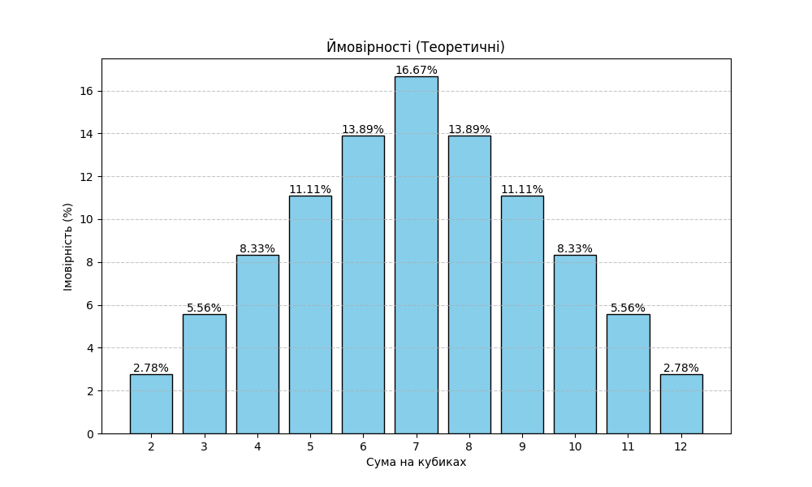

## Завдання 7. Метод Монте-Карло для імітації кидків кубиків

## 🔹 Мета

Симуляція кидків двох гральних кубиків для обчислення ймовірності кожної можливої суми (від 2 до 12) за допомогою методу Монте-Карло.

## 🔹 Підхід

- Використано 100000 ітерацій кидків.
- Підраховано кількість появ кожної суми.
- Визначено ймовірність кожної суми як частку від загальної кількості спроб.
- Створено графіки розподілу.
- Порівняно результати з аналітичними розрахунками.

## 🔹 Висновок

Отримані за допомогою методу Монте-Карло результати дуже близькі до теоретичних аналітичних значень, особливо при великій кількості ітерацій. Це підтверджує коректність реалізації симуляції та ефективність методу Монте-Карло у моделюванні ймовірностей.

## 📈 Графік

